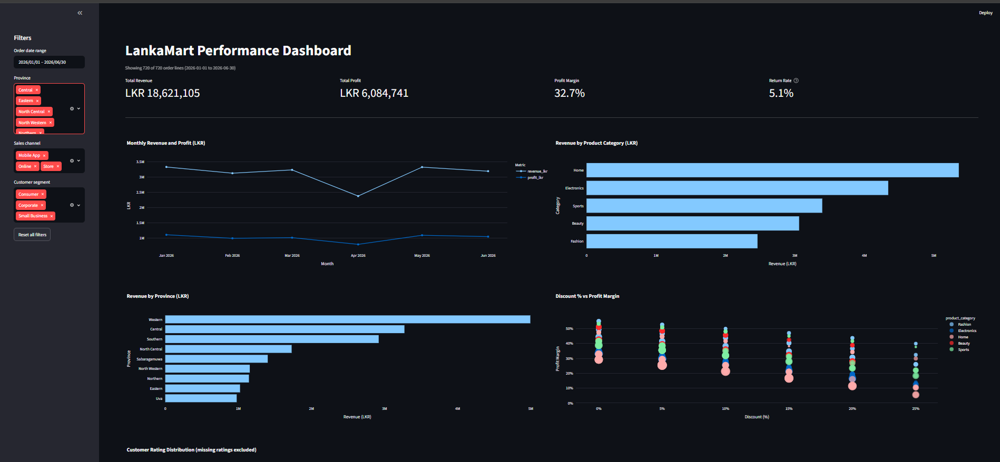

# LankaMart Retail Performance Dashboard

An interactive sales dashboard built with Python, Pandas, Plotly and Streamlit. It analyses six months (Jan to Jun 2026) of LankaMart retail transactions across nine provinces of Sri Lanka and three sales channels (Store, Online, Mobile App).

Built as a mid-semester project for CIT308 (Data Visualization). The dataset was provided by the module and is a coursework dataset, not real company data.

## Screenshot

Add a screenshot of the dashboard here:

```

```

## Features

- 4 KPI cards: Total Revenue, Total Profit, Profit Margin, Return Rate
- 5 charts:
  - Monthly revenue and profit (line chart, time trend)
  - Revenue by product category (bar chart)
  - Revenue by province (bar chart, geographic comparison)
  - Profit margin by discount level (box plot, distribution view)
  - Customer rating distribution (histogram)
- Sidebar filters: order date range, province, sales channel, customer segment
- Every KPI, chart and table updates together when a filter changes
- "Reset all filters" button
- Detail table of the filtered order lines
- Key insights panel and data quality notes

## Data cleaning

- Removed 1 duplicate row (721 rows down to 720)
- Standardised the inconsistent category label "electronic" to "Electronics"
- Left 42 missing customer ratings as missing, so they are excluded from rating charts instead of being imputed
- Treated missing promotion values as "None" (no promotion applied)
- Added calculated fields: profit margin, order month, returned flag, delivery band

## Key findings

- Total revenue LKR 18,621,105, profit LKR 6,084,741, profit margin 32.7%, return rate 5.1%
- Western province and the Home category lead on revenue
- Electronics has the highest return rate (10.0%)
- Average profit margin falls from 42.4% (0 to 5% discount) to 21.9% (25%+ discount)

## How to run

1. Install Python 3.10 or later
2. Install the libraries:

   ```
   pip install pandas numpy plotly streamlit
   ```

3. Keep `app.py` and `CIT308_LankaMart_Retail_Transactions.csv` in the same folder
4. Run the dashboard:

   ```
   python -m streamlit run app.py
   ```

5. Open http://localhost:8501 in your browser if it does not open automatically

## Tech stack

Python, Pandas, NumPy, Plotly Express, Streamlit

## Author

Sumla Musthafa
